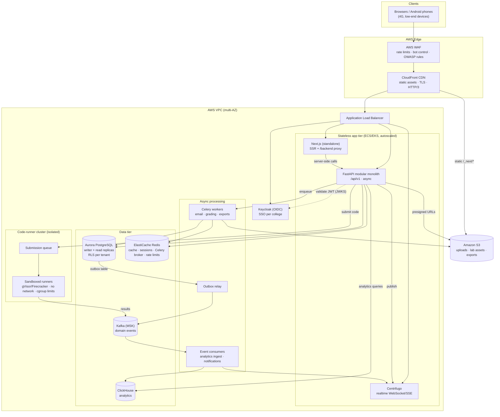

# SkillifyMe Portal — Architecture

Target: a multi-tenant practical-learning platform (LMS, coding labs, assessments, analytics) for
Indian colleges and placement training, sized for **100,000 concurrent users**, most on low-end
Android phones over 4G.

The permanent decisions live in [`CLAUDE.md`](../CLAUDE.md). This document explains the target
production shape and why it looks this way.

## Production architecture (target)

## Key decisions

### Stateless, horizontally scaled app tier

The API and web tiers keep no in-process state: sessions, caches, rate-limit counters and job queues
live in Redis; durable state in PostgreSQL; files in S3. Any instance can serve any request, so the
tier scales by adding tasks/pods behind the ALB. Rough sizing for 100k concurrent users (most idle
between clicks, roughly 5–10k req/s peak) is on the order of tens of API tasks, not hundreds.

### Modular monolith

One deployable API, split into modules (`apps/api/app/modules/<module>`) that talk only through
each other's `service.py`. This gives simple deploys and transactions now, and clean seams to extract
a module into its own service later if its scaling profile demands it. The code runner is the first
thing that is already separate (see below).

### Multi-tenancy with PostgreSQL Row-Level Security

Every tenant-owned table carries `organization_id` and an RLS policy
`organization_id = app.current_org_id()`. The API connects as a **non-owner role without
BYPASSRLS**, and sets `app.current_org` / `app.current_user` with `set_config(..., is_local => true)`
at the start of each request transaction. This means:

- a missing `WHERE organization_id = …` in application code cannot leak another college's data;
- the context is transaction-scoped, so it is safe with connection pooling (RDS Proxy / PgBouncer in
  transaction mode) and never bleeds into the next request on the same connection.

Migrations run as a separate owner role.

### Transactional outbox → Kafka

Domain events (e.g. `submission.graded`, `enrollment.created`) are inserted into `outbox_events` in
the same transaction as the state change. A relay publishes them to Kafka and marks them published.
No dual-write inconsistency; consumers are idempotent and dedupe on event id. Kafka feeds analytics
(ClickHouse), notifications, and realtime fan-out.

### Code-runner cluster

Untrusted student code never runs in the API tier. Submissions go to a queue consumed by an isolated
runner pool (gVisor/Firecracker sandboxes, no network egress, CPU/memory/time limits, read-only root
fs). The pool autoscales on queue depth independently of web traffic, which matters because
assessment windows produce sharp bursts. Lives in `services/`.

### Realtime via Centrifugo

Live leaderboards, proctoring signals, and "your code finished running" notifications go through
Centrifugo, which holds the long-lived WebSocket/SSE connections. The API only publishes to it, so
100k open sockets don't pin API workers.

### Analytics in ClickHouse

Learning-activity events land in ClickHouse via Kafka for dashboards (per-student, per-batch,
per-college). OLTP PostgreSQL stays lean; heavy aggregations never hit the primary.

### Frontend for low-end phones on 4G

- CloudFront serves static assets with long-lived immutable caching; HTTP/3 helps on lossy mobile
  networks.
- Server rendering for first paint, small client bundles, TanStack Query with conservative refetch
  defaults to save data.
- Browser calls go same-origin through the Next.js `/backend` proxy, so auth stays in httpOnly
  cookies and there's no CORS preflight round trip.

### Auth

Keycloak (OIDC) issues tokens. Colleges can federate their own IdP (Google Workspace, Azure AD).
The API validates JWTs against Keycloak's JWKS (cached), then resolves the user's organization and
roles. Authorization is enforced in the service layer; RLS is the backstop.

### Observability

Structured JSON logs (structlog) carrying `request_id` end-to-end (`X-Request-ID` is echoed to
clients), OpenTelemetry traces across Next.js → FastAPI → Postgres/Redis, and `/health/live` and
`/health/ready` probes for the orchestrator and load balancer.

## Local development equivalents

| Production          | Local (docker-compose) |
| ------------------- | ---------------------- |
| Aurora PostgreSQL   | postgres:16            |
| ElastiCache Redis   | redis:7                |
| S3                  | MinIO                  |
| MSK (Kafka)         | Redpanda               |
| Keycloak            | Keycloak (dev realm)   |
| SES / SMTP          | Mailpit                |
| ClickHouse          | added in Phase 5       |
| Centrifugo          | added in Phase 4       |
